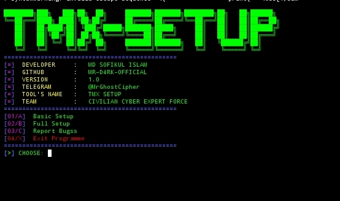

# TERMUX SET-UP TOOL
<p align="center">

<p>Tool for basic and  full termux installations. </p>
<p>Setup our termux with just one click. Please follow and give star if you use this tool.</p>

## USAGE
```python 
pkg update
apt upgrade
pkg install python
pip install git
git clone https://github.com/MR-D4RK-OFFICIAL/TMX-SETUP.git
cd TMX-SETUP
python TMX-SETUP.py
```
#### THANKS FOR USING MY TOOL
